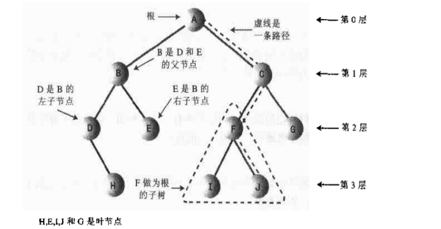
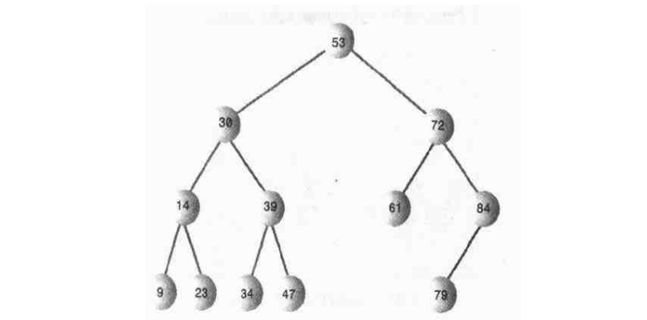
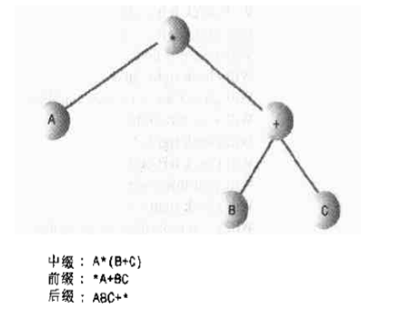
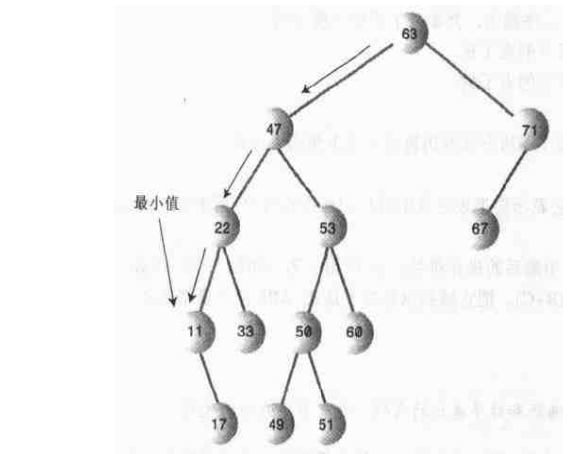

# 二叉树

## 为什么使用二叉树?

为什么要用到树呢？
因为它通常结合了另外两种数据结构的优点:一种是有序数组，另一种是链表。在树中查找数据项的速度和在有序数组中查找一样快，并且插入数据项和删除数据项的速度也和链表一样。

## 树的术语

### 路径
设想一下顺着节点的边从一个节点走到另一个节点，所经过的节点的顺序排列就称为"路径"。

### 根
树顶端的节点称为"根"。一棵树只有一个根。如果要把一个节点和边的集合定义为树，那么从根到其他任何一个节点都必须有一条(而且只有一条)路径。

### 父节点
每个节点(除了根)都恰好有一条边向上连接到另一个节点，上面的这个节点就称为下面节点的"父节点"。

### 子节点
每个节点都可能有一条或多条边连接其他节点，下面的这些节点就成为他的"子节点"。

### 叶节点
没有子节点的节点称为"叶子节点"或简称"叶节点"。树中只有一个根，但是可以有很多叶节点。

### 子树
每个节点都可以作为"子树"的根，它和它所有的子节点，子节点的子节点等都含在子树中。就像家族中那样，一个节点的子树包含它所有的子孙。

### 访问
当程序控制流程到达某个节点时，就称为"访问"这个节点，通常是为了在这个节点处只需某种操作，例如查看某个数据字段的值或显示节点。如果仅仅是在路径上从某个节点到了一个节点时经过了一个节点，不认为是访问这个节点。

### 遍历
遍历树意味着要遵循某种特定的顺序访问树中所有节点。例如，可以按关键字值的升序访问所有的节点。

### 层
一个节点的层数是指从根开始到这个节点有多少"代"。假设根是第0层，它的子节点就是第1层，它的孙节点就是第2层，以此类推。

### 关键字
可以看到，对象中通常会有一个数据域被指定为关键字值。这个值常用于查询或其他的操作。在树的图形中，如果用圆表示保存数据项的节点，那么一般将这个数据项的关键字值显示在这个圆中。

### 二叉树
如果树中每个节点最多只能有两个子节点，这样的树被称为"二叉树"。
二叉树每个节点的两个子节点被称为"左子节点"和"右子节点"，分别对应于树图形中它们的位置,如上图所示。二叉树中的节点不是必须有两个子节点；它可以只有一个左子节点，或者只有一个右子节点，或者干脆没有子节点(这种情况它就是叶节点)

如下，二叉搜索树:

**注意:**
二叉搜索树特征的定义可以这样说:一个节点的左子节点的关键字值小于这个节点，右子节点的关键字值大于或等于这个父节点。

## 一个类比
计算机系统中，人们常遇到的树是分级文件结构。给定设备的根目录(在许多系统中，通过反斜线符号指定，如C:\)是树的根。根目录下面的一层目录是根的子节点。子目录有许多层。文件代表叶节点:它们没有自己的子节点。

显然，分级文件结构不是二叉树，因为一个目录下可以有很多子节点。一个完整的路径名称，如C:\SALES\EAST\NOVEMEBER\SMITH.DAT,对应着从根到SMITH.DATA叶的路径。应用于文件结构的术语，如根和路径等，是从树的理论中借来的。

文件结构中，子目录中不含有数据；它们只有其他子目录或文件的引用1.只有文件中包含数据。而在树中，每个节点都包含数据(员工记录、汽车零件说明等等)。而且除了包含数据，除了叶子节点之外，每个节点还包含指向其他节点的引用。

## 二叉搜索树如何工作

## 遍历树
遍历树的意思是根据一种特定顺序访问树的每一个节点。这个过程不如查找、插入和删除节点常用，其中一个原因是因为遍历的速度不是特别快。不过遍历树在某些情况下是有用的，而且在理论上很有意义。

有三种简单的方法遍历树，它们是:前序、中序、后序。二叉搜索树最常用的遍历方法是中序遍历。

### 中序遍历
中序遍历二叉搜索树会使所有的节点按关键字值升序被访问到。如果希望在二叉树中创建有序的数据序列，这是一种方法。

遍历树的最简单方法是用递归的方法。用递归的方法遍历整棵树要用一个节点作为参数。初始化时这个节点是根。这个方法只需要做三件事:
1.调用自身来遍历节点的左子树;
2.访问这个节点;
3.调用自身来遍历节点的右子树;

记住访问一个节点意味着对这个节点做某种操作:先睡节点，把节点写入文件，或其他别的操作。

遍历可以应用于任何二叉树，而不只是二叉搜索树。这个遍历的原理不关心节点的关键字值:它只是看这个节点是否有子节点。

### 前序和后序遍历
除了中序之外，还有两种遍历方法:它们是前序和后序。要中序遍历一棵树的原因是很清楚的，但是要通过前序或后序来遍历树的目的就不是那么清楚了。

二叉树(不是二叉搜索树)可以用于表示包括二元运算符号+、-、/、*的算术表达式。根节点保存运算符号，其他节点或者存变量名(像A、B或C)，或者保存运算符号。每一棵子树都是一个合法的代数表达式。

前缀遍历图如下:

A*(B+C)
这样写的中缀表达法:这种写法是算法中常用的。

所有这些和前序和后序遍历有什么关系呢?
这两种遍历方法和中序遍历的三个步骤相同，只是步骤的顺序不同。下面的前序遍历preOrder()的三个步骤:
1.访问节点;
2.调用自身遍历该节点的左子树;
3.调用自身遍历该节点的右子树;

用前缀遍历的树将会生成下面的表达式:
ABC+*
这是后缀表达式。它表示要把表达式中最后的操作符号*应用于第一个和第二个算式。第一个是A，第二个是BC+.
BC+是要把表达式中最后的操作符号:+，应用于第一和第二个操作数。第一个是B，第二个是C，所以就得到中缀的(B+C)。把它插到原先的表达式ABC+*(后缀表达式)中就得到了中缀表达式A*(B+C)。

注意:
前缀遍历图中有前序遍历和后续遍历的代码，也有中序遍历的代码。

## 查找最大值和最小值
二叉搜索树中得到最大值和最小值是轻而易举的事情。
要找到最小值，先走到根的左子节点处，然后接着走到那个子节点的左子节点，如此类似，直到找到一个没有左子节点的节点。这个节点就是最小值的节点。如图:

按照相同的步骤来查找树中的最大值，不过要找到右子节点，一直向右找到没有右子节点的节点，这个节点就是最大值的节点。

## 删除节点
删除节点是二叉搜索树常用的一般操作中最复杂的。但是，删除节点在很多树中的应用中又非常重要，所以要详细研究并总结特点。

删除节点要从查找要删的节点开始入手。找到节点后，这个要删除的节点可能会有三种情况需要考虑:
1.该节点是叶节点(没有子节点);
2.该节点有一个子节点;
3.该节点有两个子节点;