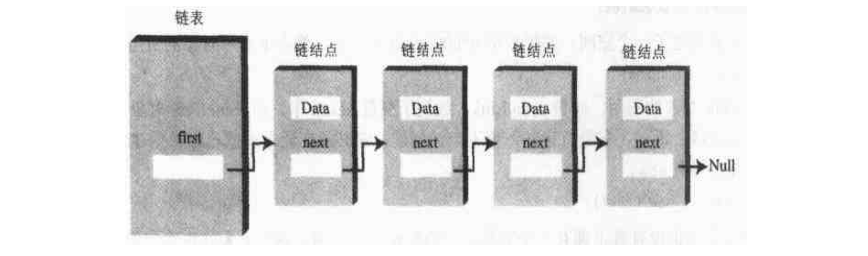
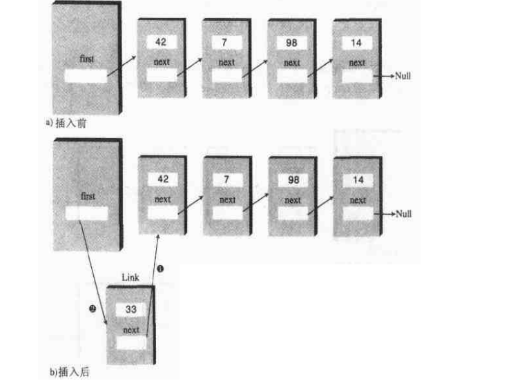
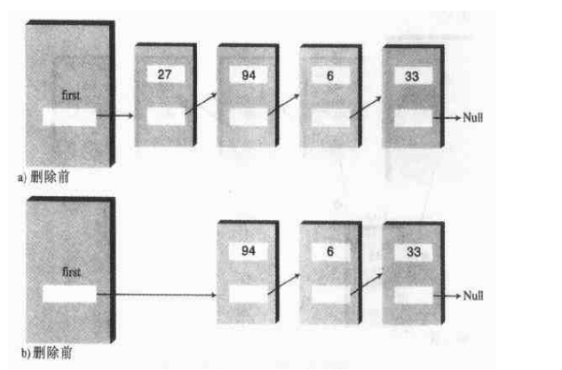
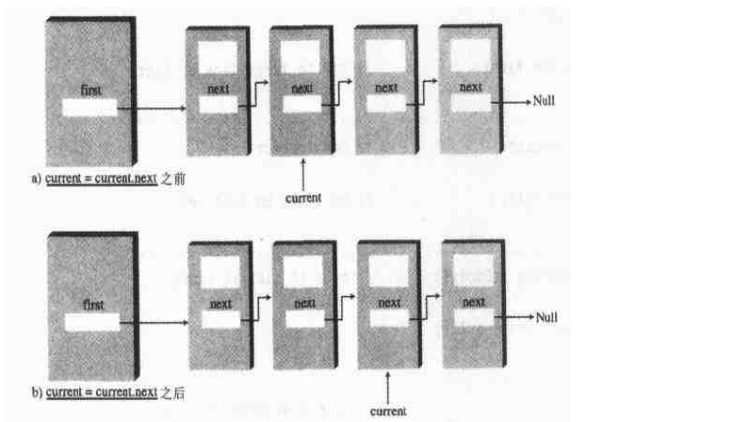
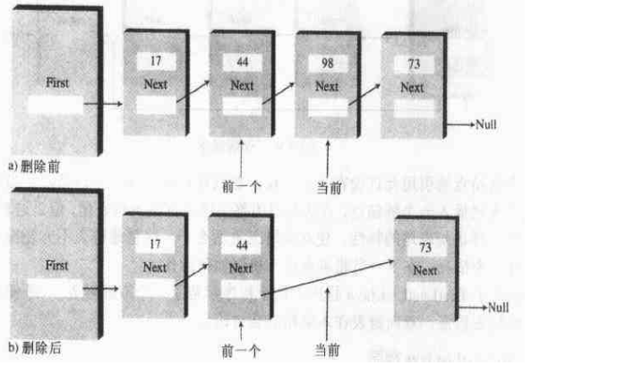
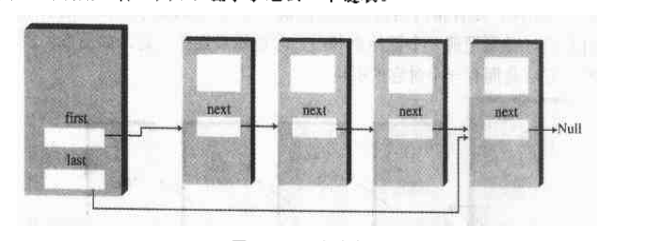

# 链表

链表继数组之后，是第二种使用最广泛的通用存储结构。

为什么不使用数组而使用链表?
比如数组大小的固定的，需要创建时指定，而链表的话，可以动态创建，不需要一开始就像数组那样定义数组的大小。

## 链结点

在链表中，每个数据项都被包含在"链结点"中。一个链结点是某个类的对象，这个类可以叫做Link。因为一个链表中有许多类似的链结点，所以有必要用一个不同于链表的类来表达链结点。每个Link对象中都包含一个对下一个链结点引用的字段(通常叫next)。但是链表本身的对象中有个字段指向对第一个链结点的引用。

如图:


#### 引用和基本类型
一个引用是一个对某个对象的参照数值，它是一个计算机内存中的对象地址，然而不需要知道所有的引用，不管它指向谁，大小都是一样的。

#### 关系，而不是位置
链表不同于数组的主要特点:
在数组中，每一项占用一个特定的位置。这个位置可以用一个下标号直接访问。它就像一排房子，你可以凭地址找到其中特定的一间。
在链表中，寻找一个特定元素的唯一方法就是沿着这个元素的链一直向下寻找。


## 单链表

LinkList类中的insertFirst()方法的作用是在表头插入一个新链结点。这是最容易插入一个链结点的地方，因为first已经指向了第一个链结点。为了插入新链结点，只需要使新创建的链结点的next字段等于原来的first的值，然后改变first的值，使它指向新创建的链结点，如图:



deleteFirst()方法是insertFirst()方法的逆操作。它通过把first重新指向第二个链结点，断开了和第一个链结点的连接。通过查看第一个链结点的next字段可以找到第二个链结点。

代码如下:
```
public Link deleteFirst(){

Link temp = first;
first = first.next;
return temp;


}

```


第二行语句是从链表中删除第一个链结点。最后需要返回链结点，为了链表使用者的方便，我们在删除它之前把它存储在temp变量中，并返回temp值。
如图(显示了如何改变first，从而删除对象):



注意:deleteFirst()方法假定链表是不为空的，调用之前，程序首先调用isEmpty()方法核实这一点。


displayList()方法
为了显示链表，从first开始，沿着引用链从一个链结点到下一个链结点。变量current按顺序指向(用术语说叫做引用)每一个链结点。
current首先指向first，那里拥有对第一个链结点的引用:
```
current = current.next

```

改变了current，使它指向下一个链结点，因为那是每个链结点的next字段的内容。代码如下:
```
public void displayList(){
System.out.print("List (first --> last):");
Link current = first;
while(current != null){
 current.displayLink();
 current = current.next;
}

System.out.println("");


}

```

链表的尾端是最后一个链结点，它的next字段为null值，而不是其他的链结点。这个字段怎么会变null呢?
因为在链结点被创建时这个字段就是null，而该链结点总是停留在链表的尾端，后来再也没有改变过。
当执行到链表的尾端的时候，while循环使用这个条件来终止自己。如图(显示了current如何沿着链表向前步进)


find()方法和很像linkList.java程序中的displayList()方法。被称为current的变量开始时指向first,
然后通过不断地把自己赋值为current.next,沿着链表向前移动。在每个链结点处，find()检查链结点的关键值是否与它寻找的相等。如果找到了，
它返回对于该链结点的引用。如果find()到达链表的尾端，但没有发现要找的链结点，则返回null。

delete()方法和find()方法类似，它先搜索要删除的链结点。然而它需要掌握的不仅是指向当前链结点的引用，还有指向当前链结点的前一个链结点的引用。这是因为，如果要删除当前链结点，必须把前一个链结点和后一个链结点连在一起。

如图(知道前一个链结点位置的唯一方法是拥有一个对它的引用):


## 双端链表
双端链表与传统的链表非常相似，不过它有一个新增的特性:即对最后一个链结点的引用，就像对第一个链结点的引用一样。如图:

对最后一个链结点的引用允许像在表头一样，在表尾直接插入一个链结点。

## 链表的效率
在表头插入和删除速度很快，仅仅需要改变以一两个引用值，所以花费O(1)的时间。
平均起来，查找、删除和在指定链结点后面插入都需要搜索链表中的一半链结点。需要O(N)次比较。在数组中执行这些操作也需要O(N)次比较，但是链表仍然要快一些，因为当插入和删除链结点时，链表不需要移动任何东西。增加的效率是很显著的，特别是当复制时间远远大于比较时间的时候。

链表比数组优越的另外一个重要方面是链表需要多少内存就可以用多少内存，并且可以扩展到所有可用内存。

数组的大小在它创建的时候就固定了，所以经常由于数组太大导致效率低下，或者数组太小导致空间溢出。

向量是一种可扩展的数组，它可以通过可变长度解决这个问题，但是它经常只允许以固定大小的增量扩展(例如快要溢出的时候，就增加一倍数组容量)。这个解决方案在内存使用效率上来说还是要比链表的低。

## 抽象数组类型
栈和队列都是ADT的例子。

用链表实现的栈
例子:https://github.com/developers-youcong/AlgorithmOfhomework/tree/master/Java%E6%95%B0%E6%8D%AE%E7%BB%93%E6%9E%84%E4%B8%8E%E7%AE%97%E6%B3%95/List/example/%E7%94%A8%E9%93%BE%E8%A1%A8%E5%AE%9E%E7%8E%B0%E7%9A%84%E6%A0%88

用链表实现的队列
例子:https://github.com/developers-youcong/AlgorithmOfhomework/tree/master/Java%E6%95%B0%E6%8D%AE%E7%BB%93%E6%9E%84%E4%B8%8E%E7%AE%97%E6%B3%95/List/example/%E7%94%A8%E9%93%BE%E8%A1%A8%E5%AE%9E%E7%8E%B0%E7%9A%84%E9%98%9F%E5%88%97

## 有序链表
在有序链表中，数组是按照关键值有序排列的。
有序链表的删除常常是只限于删除在链表头部的最小(或者最大)链结点。

一般，在大多数需要使用有序数组的场合也可以使用有序链表。有序链表优于有序数组的地方是插入的速度(因为元素不需要移动)，另外链表可以扩展到全部有效的使用内存，而数组只能局限于一个固定的大小中。但是，有序链表实现起来比有序数组更困难一些。

有序链表可以用于一种高效的排序机制。假设有一个无序数组。如果从这个数组中取出数据，然后一个一个地插入有序链表，它们自动地按顺序排列。把它们从有序表中删除，重新放入数组，那么数组就会排好序了。这种排序方式总体上比在数组中用常用的插入排序效率更高一些(这是因为复制次数少一些)。

它仍然是一个时间级为O(N2)的过程，因为在有序链表中每插入一个新的链结点，平均要与一半已存在数据进行比较，如果插入N个新数据，就进行N2/4次比较。每个链结点只进行两次复制:一次从数组到链表，一次从链表到数组。在数组中进行插入排序需要N2次移动，相比之下，2*N次移动更好。

## 双向链表
双向链表不等同于双端链表。

双向链表有什么优点?
传统链表的一个潜在问题是沿着链表的反向遍历是困难的。用这样一个语句:
```
current = current.next

```

可以很方便地到达下一个链结点，然而没有对应的方法回到前一个链结点。根据应用的不同，这个限制可能会引起问题。

例如:
假设一个文本编辑器用链表来存储文本。屏幕上每一行文字作为一个String对象存储在链结点中。当编辑器用户向下移动光标时，程序移到下一个链结点操纵或显示新的一行。但是如果用户向上移动光标会发生什么呢？在普通的链表中，需要把current变量(或起同等作用的其他变量)调回到表头，再一步一步地向后步进新的当前链结点，这样效率非常低。因此需要一个简单的向回头方向走一步的操作。

双向链表提供这个能力:运行向前遍历，也允许向后遍历整个链表。其中秘密在于每个链结点有两个指向其他链结点的引用，而不是一个。第一个像普通链表一样指向下一个链结点。第二个指向前一个链结点。如图:
![图七(img/07.png)

例子:https://github.com/developers-youcong/AlgorithmOfhomework/tree/master/Java%E6%95%B0%E6%8D%AE%E7%BB%93%E6%9E%84%E4%B8%8E%E7%AE%97%E6%B3%95/List/example/%E5%8F%8C%E5%90%91%E9%93%BE%E8%A1%A8

双向链表可以用于作为双端队列的基础。在双端队列中，可以从任何一头插入和删除，双向链表提供了这个能力。

## 迭代器
假设要遍历一个链表，并在某些特定的链结点上执行一些操作。例如，用一个链表存储的职员表。你可能需要提高所有拿最低工资的员工的工资，而不影响那些已经高于最低工资的员工。或者假设一个订阅邮件用户的链表，你需要删除所有近六个月订阅任何邮件的用户。

在数组中，这种操作非常容易，因为可以用数组下标跟踪所在位置。可以在这个链结点上进行操作，然后通过下标指向下一项，看这项是否符合操作条件。然而在链表中，链结点没有固定的下标。怎样才能提供给链表用户类似于数组下标的东西呢?虽然可以反复使用find()方法在链表中查找合乎要求的链结点，但是为查找每个链结点这个方法进行很多次比较。如果能从链结点到链结点步进，检查每个链结点是否符合某个标准，若符合标准就执行适当的操作，这样效率会高得多。

放在链表内部吗？
作为类的用户，需要能存取指向任意链结点的引用。这样就可以考察和修改链结点。引用应该能递增，因此可以沿着整个链表遍历，依次查看每个链结点，而且可以访问这个引用所指向的链结点。

迭代器类包含对数据结构中数据项的引用，并用来遍历这些结构的对象(有时，在某些Java类中，叫做"枚举类")。

迭代器包含如下方法:
reset()-把迭代器设在表头
nextLink()-返回迭代器指向的链结点
getCurrent()-返回迭代器指向的链结点
atEnd()-如果迭代器到达表尾，返回true
insertAfter()-在迭代器后面插入一个新链结点
insertBefore()-在迭代器前面插入一个新链结点
deleteCurrent()-删除迭代器所指链结点

例子:
https://github.com/developers-youcong/AlgorithmOfhomework/tree/master/Java%E6%95%B0%E6%8D%AE%E7%BB%93%E6%9E%84%E4%B8%8E%E7%AE%97%E6%B3%95/List/example/%E8%BF%AD%E4%BB%A3%E5%99%A8

总结:
- 链表包含一个LinkedList对象和许多Link对象
- LinkedList对象包含一个引用，这个引用通常叫做first，它指向链表的第一个链结点
- 每个Link对象包含数据和一个引用，通常叫做next，它指向链表的下一个链结点
- next字段为null值意味着链表的结尾
- 在表头插入链结点需要把新链结点的next字段指向原来的第一个链结点，然后把first指向新链结点
- 在表头删除链结点要把first指向first.next
- 为了遍历链表，从first开始，然后从一个链结点到下一个链结点，方法是用每个链结点的next字段找到下一个链结点
- 通过遍历链表可以找到拥有特定值的链结点。一旦找到，可以显示、删除或用其他方式操纵该链结点
- 新链结点可以插入某个特定值的链结点的前面或后面，首先要遍历找到这个链结点
- 双端链表在链表中维护一个指向向最后一个链结点的引用，它通常和first一样，叫做last
- 双端链表允许在表尾插入数据项
- 抽象数据类型是一种数据存储类，不涉及它的实现
- 栈和队列是ADT。它们既可以用数组实现，又可以用链表实现
- 在有序链表中国，链结点按照关键值升序(有时是降序)排列
- 在有序链表中插入需要O(N)的时间，因为必须需找到正确的插入点。最小值链结点的删除需要O(1)时间
- 双向链表中，每个链结点包含对前一个链结点的引用，同时有对后一个链结点的引用
- 双向链表允许反向遍历，并可以从表尾删除
- 迭代器是一个引用，它被封装在类对象中，这个引用指向相关联的链表中的链结点
- 迭代器方法允许使用者沿链表移动迭代器，并访问当前指示的链结点
- 能用迭代器遍历链表，在选定的链结点(或所有链结点)上执行某些操作