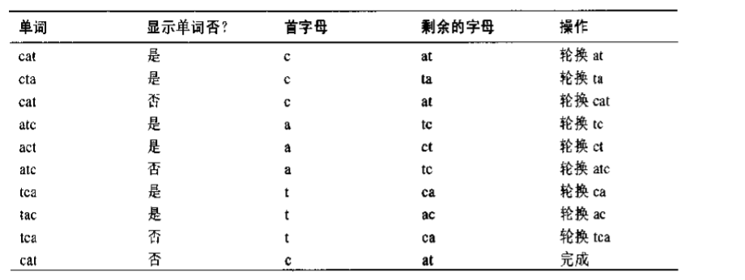

# 递归

## 递归方法特征

1.调用自身;
2.当它调用自身的时候，它这样做是为了解决更小的问题;
3.存在某个足够简单的问题的层次，在这一层算法不需要调用自己就可以直接解答，且返回结果

在递归算法每次调用自身的过程中，参数变小(也许被多个参数描述的范围变小)，这反映了问题变小或变简单的事实。当参数或者范围达到一定的最小值时，将会触发一个条件，此时方法不需要调用自身而可以返回。

## 递归方法有效率吗?
调用一个方法会有一定的额外开销。控制必须从这个调用的位置转移到这个方法的开始处。除此之外，传给这个方法的参数以及这个方法返回的地址都要被压入一个内部的栈里，为的是这个方法可以访问参数值和知道返回到哪里。

另外一个低效性反映在系统内存空间存储所有的中间参数以及返回值，如果有大量的数据需要存储，这就会引起栈溢出的问题。

采用递归的原因是因为从概念上简化问题，并不代表其本质上更有效率。

## 阶乘
阶乘在概念上和三角数字是类似的，只是用乘法取代了加法。得到第n个三角数字是通过n加上第n-1个三角数字的和，而n的阶乘则是通过n乘以n-1的阶乘来得到的。

## 变位字
递归的另一种情况。在这种情况中递归提供了一种对问题的简洁解决方法。排列是按照一定的顺序安排事物。假设想要列出一个指定单词的所有变位字，也就是列出该词的全排列(不管这些排列是否是真正的英语单词)，它们都是由原来这个单词的字母组成。我们称这个工作是变位一个单词或称全排列一个单词。比如，全排列cat，会产生:
- cat
- cta
- atc
- act
- tca
- tac

你会怎样写一个程序来全排列单词呢?
这里有一个方法。假设这个词有n个字母。
1.全排列最右边的n-1个字母
2.轮换所有n个字母
3.重复以上步骤n次

轮换这个词意味着所有的字母向左移一位，但最左边的字母例外，它"转换"至最右边字母的后边，如图:

注意:在执行3个字母的轮换前其他两个字母必须轮换会开始的位置。这会导致出现像cat,cta，cat这样的序列。这个多余单词将不显示。

如何来全排列最右边的n-1个字母?
通过调用自己。

## 递归的二分查找

递归的二分查找和非递归的二分查找又同样的大O效率:O(logN)。递归的二分查找更为简洁一些，但是它的速度可能会慢一些。

### 分治算法
递归的二分查找法是分治算法的一个例子。把一个人问题分成两个相对来说更小的问题，并且分别解决每一个小问题。对每一个小问题的解决方法是一样的:把每个小问题分成两个更小的问题，并且解决它们。这个过程一直持续下去直到达到易于求解的基值情况，就不用再继续分了。

分治算法常常是一个方法，在这个方法中含有两个对自身的递归调用，分别对应于问题的两个部分。在二分查找中，就有两个这样的调用，但是只有一个真的执行了(调用哪一个取决于关键字的值).

## 汉诺塔问题
汉诺塔问题是由很多放置在三个塔座上的盘子组成的一个古老的难题，如图:

所有盘子的直径是不同的，并且盘子中央都有一个洞以使它们刚好可以放到塔座上。所有的盘子刚开始都放在塔座A上。这个难题的目标是将所有的盘子都从塔座A移动到塔座C上。每一次只可以移动一个盘子，并且任何一个盘子都不可以放在比自己小的盘子之上。

## 归并排序
归并排序比简单排序更有效。
冒泡排序、插入排序和选择排序所用时间:O(N2)
归并排序:O(N*logN)

归并排序的缺点:它需要在存储器中有另一个大小等于被排序的数据项数目的数组，如果初始数组几乎占满整个存储器，那么归并排序将不能工作。但是，如果有足够的空间，归并排序会是一个很好的选择。

### 归并排序的效率
归并排序的运行时间是O(N*logN)。

那么是如何知道这个时间的呢?
首先看在这个算法执行的过程当中，如何计算一个数据项***被复制的次数***以及和其他数据项***比较的次数***。

## 消除递归

### 递归和栈
递归和栈之间有一种紧密的联系。事实上，大部分的编译器都是使用栈来实现递归的。正如我们曾提到过的，当调用一个方法的时候，编译器会把这个方法的所有参赛及其返回地址(这个方法返回时控制到达的地方)都压入栈中，然后把控制转移给这个方法。当这个方法返回的时候。这些值退栈。参赛消失了，并且控制权重重新回到返回地址处。

## 递归的有趣应用

### 求一个数的乘方

### 背包问题

### 组合:选择一支队

## 小结
- 一个递归的方法每次用不同的参数值反复调用自身
- 某种参数值使递归的方法返回，而不再调用自身。这称为基值情况
- 当递归方法返回时，递归过程通过逐渐完成各层方法实例的未执行部分，而从最内层返回到最外层的原始调用处
- 三角数字是它本身以及所欲比它小的数字的和。例如,4的三角数字是10，因为4+3+2+1=10
- 一个数的阶乘是它自身和所有比它小的数的乘积。例如4的阶乘是4*3*2*1=24
- 三角数字和阶乘都可以通过递归的方法或者简单的循环方法来实现
- 一个单词的全排列(它的n个字母的所有可能排列)可以通过反复地轮换它的字母以及全排列它最右边的n-1个字母来递归得到
- 二分查找可以通过检查查找关键字在有序序列的哪一半，然后在这一半做相同的事情，这些都可以用递归实现
- 汉诺塔的问题包含三个塔座和任意数量的盘子
- 汉诺塔难题可以用递归来解决:把除了最低端盘子外的所有盘子形成的子树移动到一个中介塔座上，然后把最低端的盘子移到目标塔座上，最终把那个子树移动到目标塔座上
- 归并两个有序数组意思是创建第三个数组，这个数组按顺序存储从这个两个有序数组中取到的所有数据项
- 在归并排序中，一个大数组的单个数据项的子数组归并为两个数据项的子数组，然后两个数据项的子数组归并为4个数据项的子数组，如此下去直到所有的数组数据项有序
- 归并排序需要一个大小等于原来数组的工作空间
- 对于三角数字、阶乘、单词字母全排列以及二分查找，它们的递归的方法只包含一次对自身的调用
- 对于汉诺塔和归并排序问题，它们的递归的方法包括两次递归的调用
- 任何可以用递归完成的操作都可以用一个栈来实现
- 递归的方法可能效率低。如果是这样的话，有时可以用一个简单循环或者是一个基于栈的方法替代它
