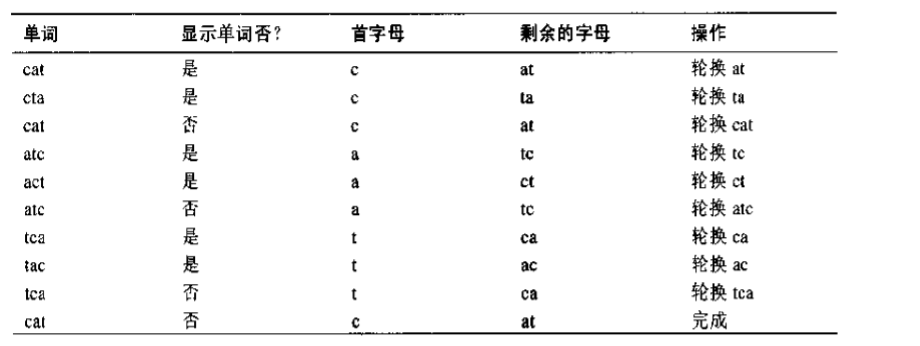

# 递归

## 递归方法特征

1.调用自身;
2.当它调用自身的时候，它这样做是为了解决更小的问题;
3.存在某个足够简单的问题的层次，在这一层算法不需要调用自己就可以直接解答，且返回结果

在递归算法每次调用自身的过程中，参数变小(也许被多个参数描述的范围变小)，这反映了问题变小或变简单的事实。当参数或者范围达到一定的最小值时，将会触发一个条件，此时方法不需要调用自身而可以返回。

## 递归方法有效率吗?
调用一个方法会有一定的额外开销。控制必须从这个调用的位置转移到这个方法的开始处。除此之外，传给这个方法的参数以及这个方法返回的地址都要被压入一个内部的栈里，为的是这个方法可以访问参数值和知道返回到哪里。

另外一个低效性反映在系统内存空间存储所有的中间参数以及返回值，如果有大量的数据需要存储，这就会引起栈溢出的问题。

采用递归的原因是因为从概念上简化问题，并不代表其本质上更有效率。

## 阶乘
阶乘在概念上和三角数字是类似的，只是用乘法取代了加法。得到第n个三角数字是通过n加上第n-1个三角数字的和，而n的阶乘则是通过n乘以n-1的阶乘来得到的。

## 变位字
递归的另一种情况。在这种情况中递归提供了一种对问题的简洁解决方法。排列是按照一定的顺序安排事物。假设想要列出一个指定单词的所有变位字，也就是列出该词的全排列(不管这些排列是否是真正的英语单词)，它们都是由原来这个单词的字母组成。我们称这个工作是变位一个单词或称全排列一个单词。比如，全排列cat，会产生:
- cat
- cta
- atc
- act
- tca
- tac

你会怎样写一个程序来全排列单词呢?
这里有一个方法。假设这个词有n个字母。
1.全排列最右边的n-1个字母
2.轮换所有n个字母
3.重复以上步骤n次

轮换这个词意味着所有的字母向左移一位，但最左边的字母例外，它"转换"至最右边字母的后边，如图:

注意:在执行3个字母的轮换前其他两个字母必须轮换会开始的位置。这会导致出现像cat,cta，cat这样的序列。这个多余单词将不显示。

如何来全排列最右边的n-1个字母?
通过调用自己。
